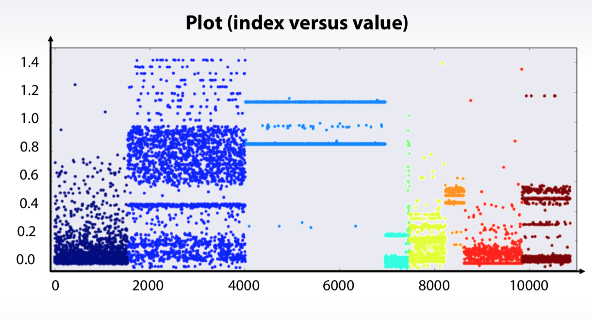

# Exploratory data analysis

## What and Why?
- Better understand the data
- Build an intuition about the data
- Generate hypothesizes
- Find insights


## Building intuition about the data
1. Get domain knowledge
– It helps to deeper understand the problem
2. Check if the data is intuitive
– And agrees with domain knowledge
3. Understand how the data was generated
- As it is crucial to set up a proper validation
---
4. Explore individual features
5. Explore pairs and groups
---
6. Clean features up
---
7. Check for leaks!


## Exploring anonymized data
Two things to do with anonymized features:
1. Try to decode the features
- Guess the true meaning of the feature
2. Guess the feature types
- Each type needs its own preprocessing


## Visualization

> EDA is an art And visualizations are our art tools !

### Tools for individual features exploration

1. Histograms:
```python
plt.hist(x)
```
2. Plot (index versus value):
```python
plt.plot(x, '.')
```
3. Statistics:
```python
df.describe()
x.mean()
x.var()
```
4. Other tools:
```python
x.value_counts()
x.isnull()
```

### Explore feature relations 
1. Pairs
− Scatter plot, scatter matrix
− Corrplot
```python
plt.scatter(x1, x2)
pd.scatter_matrix(df)
df.corr()
plt.matshow()
```
2. Groups
− Corrplot + clustering
− Plot (index vs feature statistics)
```
df.mean().plot(style=’.’)
df.mean().sort_values().plot(style=’.’)
```

### Examples





### Dataset cleaning

1. Constant features
```python
train.nunique(axis=1) == 1
```
2. Duplicated features
```python
traintest.T.drop_duplicates()

for f in categorical_feats: 
    traintest[f] = raintest[f].factorize()
traintest.T.drop_duplicates()
```
3. Duplicated rows
- Check if same rows have same label
- Find duplicated rows, understand why they are duplicated

4. Check if dataset is shuffled


    